# Marmorikatu Mobile

A Kotlin Multiplatform (Android + iOS) home-automation client for the
"Marmorikatu" house, with a shared Compose Multiplatform UI in Finnish.

## What it is

Marmorikatu Mobile is the family-facing app for a self-hosted home-automation
stack. It shows live house state (lights, temperatures, air quality, heat pump,
energy, electricity price) and lets the family control lights and the TV, talk
to a voice assistant, and read a live announcement feed.

The same binary drives three surfaces, chosen automatically from the window
size (plus one explicit mode):

- **Phone** — the default portrait layout with a bottom tab bar.
- **Tablet / kiosk** — a wide landscape dashboard (`TabletKotiDashboard`) with a
  left navigation rail, intended for an always-on shelf tablet.
- **Kid mode** — a deliberately reduced surface (a greeting, the child's own
  light, shared rooms, and a big voice button); a parent switches it on and it
  survives a reboot.

A hidden developer diagnostics screen is reachable by long-pressing the
"Marmorikatu" kicker in the header, and from **Asetukset → Diagnostiikka**.

## Screens

The app has seven destinations. On the phone the tab bar shows six of them and
reaches **Tapahtumat** through the header bell (with an unread badge); the
tablet rail reaches **Koti** through the brand tile and **Tapahtumat** through
the bell.

| Screen | Contents |
|---|---|
| **Koti** | Home dashboard: greeting, weather, an attention strip, waste-pickup schedule, light scene presets, room temperatures, KPI readouts, news, door camera, and the voice dock. |
| **Valot** | Lighting grouped by floor: scene presets plus collapsible per-fixture group cards and single toggles. |
| **Ilmasto** | Climate, in sub-tabs: room temperatures, air quality, Ruuvi sensors, heat pump (Maalämpö), and ventilation. |
| **Energia** | Spot electricity price and energy meters. |
| **Bussit** | Nysse bus departures. |
| **Kalenteri** | Family calendar and waste pickup. |
| **Tapahtumat** | Live announcement feed with camera stills. |

<table>
  <tr>
    <td align="center">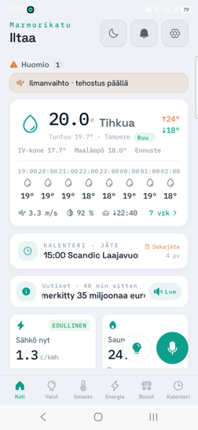<br><sub>Koti — weather, alerts, door camera</sub></td>
    <td align="center">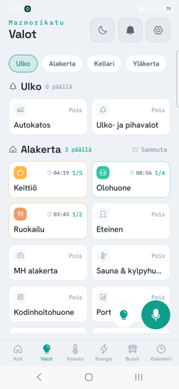<br><sub>Valot — scene presets + floors</sub></td>
    <td align="center">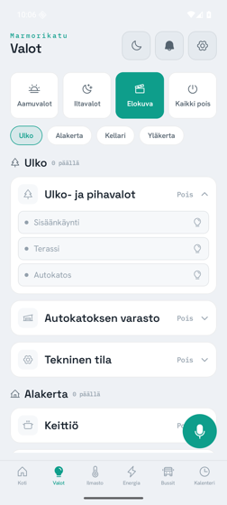<br><sub>Valot — per-fixture group card</sub></td>
    <td align="center">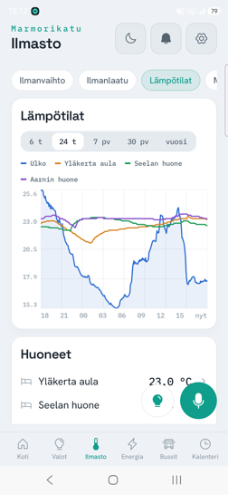<br><sub>Ilmasto — temperatures</sub></td>
  </tr>
  <tr>
    <td align="center">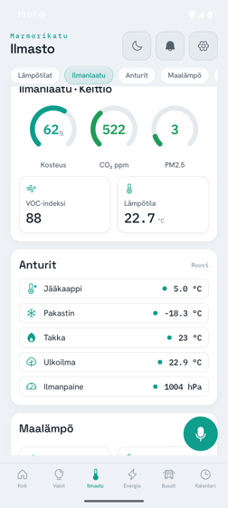<br><sub>Ilmasto — air quality</sub></td>
    <td align="center">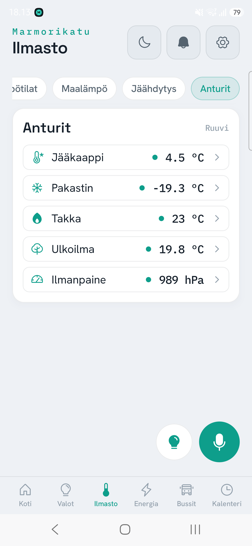<br><sub>Ilmasto — Ruuvi sensors</sub></td>
    <td align="center">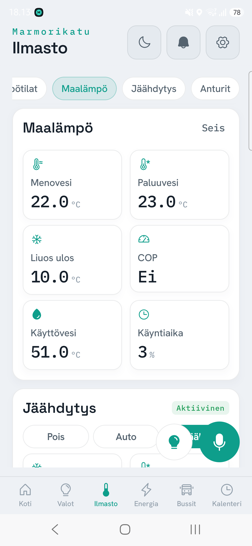<br><sub>Ilmasto — heat pump</sub></td>
    <td align="center">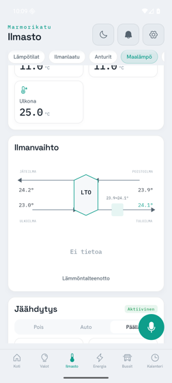<br><sub>Ilmasto — ventilation &amp; cooling</sub></td>
  </tr>
  <tr>
    <td align="center">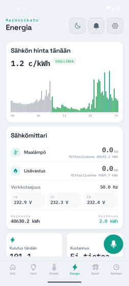<br><sub>Energia — spot price</sub></td>
    <td align="center">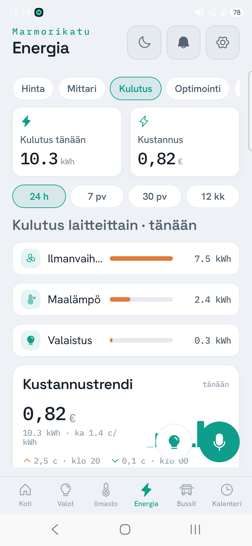<br><sub>Energia — consumption</sub></td>
    <td align="center">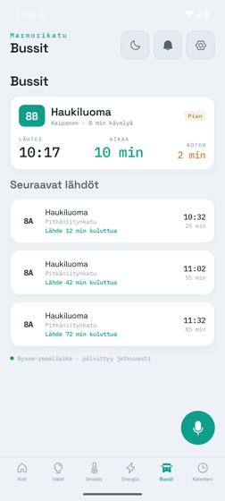<br><sub>Bussit — departures</sub></td>
    <td align="center">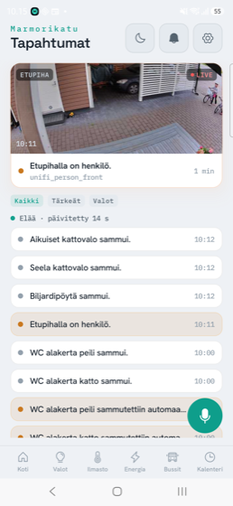<br><sub>Tapahtumat — feed &amp; camera</sub></td>
  </tr>
  <tr>
    <td align="center">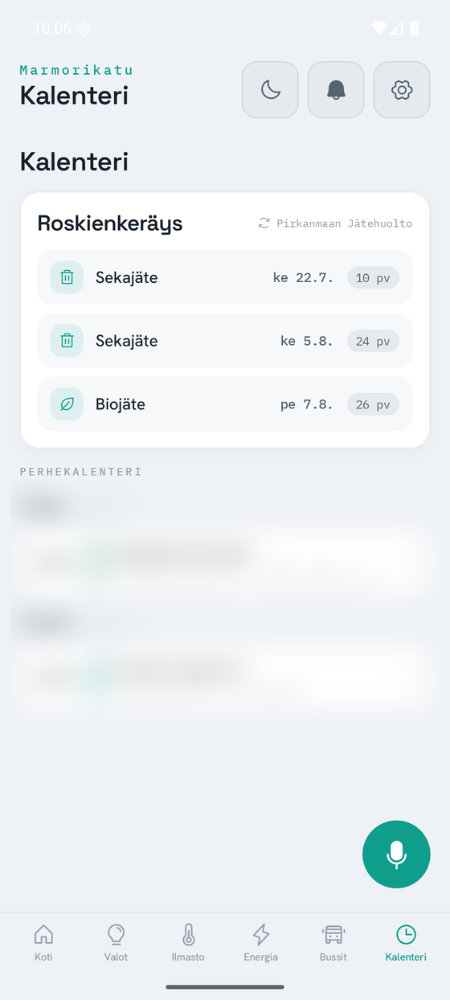<br><sub>Kalenteri — waste &amp; family calendar</sub></td>
    <td align="center">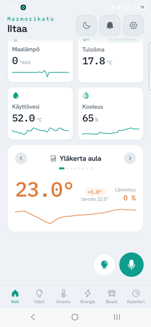<br><sub>Koti — presets &amp; room temps</sub></td>
    <td align="center">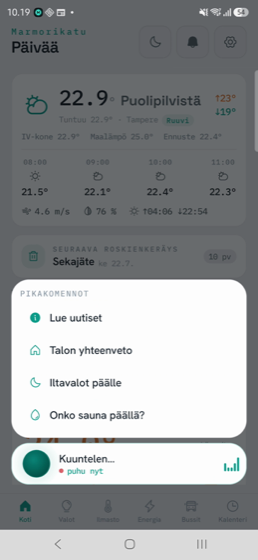<br><sub>Voice — listening + quick commands</sub></td>
    <td></td>
  </tr>
</table>

<sub>The family-calendar entries are blurred in the capture; everything else is live house data.</sub>

All captures live in [`docs/screenshots/`](docs/screenshots/) and are regenerated
with [`scripts/capture-demo.sh`](scripts/capture-demo.sh).

## Architecture

Two Gradle modules plus an Xcode wrapper (`settings.gradle.kts` includes only
the first two; `iosApp` is a plain Xcode project, not a Gradle module):

- **`core`** (`fi.marmorikatu.core`) — everything below the UI: config,
  transports, repositories, models, connection lifecycle, audio, and voice.
  Pure Kotlin, no Compose.
- **`composeApp`** (`fi.marmorikatu.app`) — the Compose Multiplatform UI: theme,
  icons, component library, the seven screens, and the three surfaces. It also
  builds the static `ComposeApp` framework consumed by iOS.
- **`iosApp`** — the Xcode project that embeds the framework and launches the
  Compose UI (bundle id `fi.marmorikatu.app`).

Repositories in `fi.marmorikatu.core.repository` hide the transport mix behind
plain interfaces and `Flow`s; the UI only ever sees repositories, never a
socket or an HTTP call. Dependency injection is wired with Koin
(`core/di/CoreModule.kt` plus the app-side modules). The full data-flow model —
repositories, the three auto-selected UI surfaces, optimistic light control, and
the connection lifecycle — is in **[docs/architecture.md](docs/architecture.md)**.

### Transport map (hybrid by design)

The app deliberately mixes a live MQTT feed with several request/response HTTP
services:

| Transport | Library | Used for |
|---|---|---|
| **MQTT** | MQTTastic (TCP) | Live, retained device state (instant snapshot on connect), single light commands (fast path), the ThermIQ heat-pump register dump, and the Ruuvi Gateway sensor feed. |
| **MCP** | MCP Kotlin SDK (streamable HTTP) | Light catalog + batched light commands, Harmony TV control, and reads for heat pump, room temperatures, sauna, electricity prices, air quality, energy, weather, news, calendar, and a daily report. |
| **claude-bridge** | Ktor client (SSE + NDJSON) | Assistant chat streaming, voice transcription (Whisper) and speech (Piper), and the announcements push feed with `Last-Event-ID` resume. |
| **InfluxDB** | Ktor client (Flux over HTTP) | Deep time-series history for the charts (the MCP data tool caps at 100 rows). |
| **Direct HTTP** | Ktor client | Nysse bus departures. |

The retained `marmorikatu/*` state topics (instant snapshot on connect, ~13 s
republish), the single-light command path, the ThermIQ register dump, the Ruuvi
feed, and the SSE/NDJSON stream formats are all documented in
**[docs/protocols.md](docs/protocols.md)**.

### Voice

<p align="center">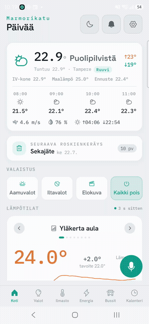</p>

Tapping the mic opens the voice dock — a quick-command menu plus a live
"listening" state — and speaks the assistant's reply back.

Voice I/O is pluggable behind **native** on-device engines (Android
`SpeechRecognizer` / `TextToSpeech`, iOS `SFSpeechRecognizer` /
`AVSpeechSynthesizer`) and a **server** pipeline (Whisper transcription + Piper
TTS, the same Finnish "house voice" as the kiosk). It defaults to native and
falls back to the server for Finnish when the device can't transcribe it — see
**[docs/cross-platform.md](docs/cross-platform.md)**, which also covers
background announcement delivery (an Android foreground service; not available on
iOS).

## Documentation

Deeper references live in [`docs/`](docs/):

- **[Architecture](docs/architecture.md)** — the module split, repositories-over-transport, the three UI surfaces, optimistic light control, and the connection lifecycle.
- **[Protocols](docs/protocols.md)** — MQTT / MCP / claude-bridge / InfluxDB / HTTP: topics, payload shapes, and stream formats.
- **[Alarms](docs/alarms.md)** — every heat-pump, ventilation, Ruuvi-sensor and sauna alert, its source, and the exact threshold.
- **[Cross-platform](docs/cross-platform.md)** — the `expect`/`actual` seams, the native-vs-server voice engines, and Android-vs-iOS build/runtime config.

## Tech stack

| Area | Choice | Version |
|---|---|---|
| Language | Kotlin (Multiplatform) | 2.4.0 |
| UI | Compose Multiplatform | 1.11.1 |
| Android Gradle Plugin | AGP | 8.13.2 |
| Android SDK | compileSdk / targetSdk / minSdk | 37 / 36 / 26 |
| JVM target | JDK | 17 |
| HTTP | Ktor client (OkHttp on Android, Darwin on iOS) | 3.5.1 |
| DI | Koin | 4.2.2 |
| Async | kotlinx-coroutines | 1.10.2 |
| Serialization | kotlinx-serialization | 1.9.0 |
| Date/time | kotlinx-datetime | 0.8.0 |
| MCP | MCP Kotlin SDK (client) | 0.14.0 |
| MQTT | MQTTastic (`org.meshtastic:mqtt-client`) | 0.4.0 |
| Settings | multiplatform-settings | 1.3.0 |
| Logging | Kermit | 2.0.6 |
| Testing | kotlin-test, coroutines-test, Turbine, Ktor mock | Turbine 1.2.0 |

Bundled fonts: Space Grotesk (display), Hanken Grotesk (UI/body), and IBM Plex
Mono (numeric readouts). Icons are a Phosphor-derived vector set (`MkIcons`).
Exact versions are pinned in [`gradle/libs.versions.toml`](gradle/libs.versions.toml).

## Project layout

```
marmorikatu-mobile/
├── core/                         # KMP library: transports, repositories, models
│   └── src/
│       ├── commonMain/kotlin/fi/marmorikatu/core/
│       │   ├── config/           # AppConfig + ConfigStore (persisted overrides)
│       │   ├── di/               # Koin CoreModule
│       │   ├── model/            # Domain models (Light, Climate, Energy, …)
│       │   ├── transport/        # mqtt, mcp, bridge, influx, widgets, http
│       │   ├── repository/       # Repositories + Reconciler
│       │   ├── lifecycle/        # ConnectionManager, reconnect, foreground
│       │   ├── background/       # Background announcement mode
│       │   ├── audio/            # Recorder / player (expect/actual)
│       │   ├── haptics/          # Haptics (expect/actual)
│       │   └── speech/           # SpeechToText / SpeechOutput engines
│       ├── androidMain/ · iosMain/   # Platform actuals
│       └── commonTest/           # Shared unit tests + captured fixtures
├── composeApp/                   # Compose Multiplatform app + iOS framework
│   └── src/commonMain/kotlin/fi/marmorikatu/app/
│       ├── screens/              # Koti, Valot, Ilmasto, Energia, Bussit,
│       │                         #   Kalenteri, Tapahtumat, TabletKotiDashboard
│       ├── shell/                # App shell, surfaces, settings, view models
│       ├── components/           # Reusable UI component library
│       ├── theme/  · icons/      # Design tokens, type, effects, MkIcons
│       └── di/  · format/  · debug/
├── iosApp/                       # Xcode project (scheme: iosApp)
├── docs/                         # architecture / protocols / alarms / cross-platform guides
│   └── screenshots/              # reference captures of each view + voice GIF
├── scripts/capture-demo.sh       # regenerates docs/screenshots (+ voice GIF)
└── gradle/libs.versions.toml     # Version catalog
```

## Build & run

### Prerequisites

- JDK 17
- Android SDK (compileSdk 37; `local.properties` must point `sdk.dir` at it)
- Xcode (for the iOS app)

### Android

```bash
# Build a debug APK
./gradlew :composeApp:assembleDebug

# Build and install on a running device/emulator
./gradlew :composeApp:installDebug
```

### iOS

Open `iosApp/iosApp.xcodeproj` in Xcode, select the **iosApp** scheme, and run.

From the command line the architecture must be pinned to `arm64` — the project
declares only `iosArm64` and `iosSimulatorArm64` (MQTTastic ships no `iosX64`),
so a generic simulator destination fails:

```bash
xcodebuild -project iosApp/iosApp.xcodeproj -scheme iosApp \
  -sdk iphonesimulator -configuration Debug ARCHS=arm64 ONLY_ACTIVE_ARCH=YES build
```

A framework-only compile check without Xcode:

```bash
./gradlew :composeApp:compileKotlinIosSimulatorArm64
```

## Configuration

Connection endpoints and UI preferences live in `AppConfig` and are persisted by
`ConfigStore` (via multiplatform-settings). A host change from the settings UI
takes effect on the next (re)connect, without an app restart. The overridable
endpoints are:

- **`serverHost`** — the single host that serves the MCP, bridge, bus, and
  InfluxDB services (each on its own port).
- **`mqttHost`** / **`mqttPort`** — the MQTT broker, kept separate because it
  runs on a different machine from the other services.

Both are editable in the diagnostics screen — useful when the default broker
name doesn't resolve over the VPN and you need to point it at a LAN address.
Persisted UI preferences include theme, kid mode, native-vs-server STT/TTS,
haptics, and background listening.

## Security model — the LAN is the boundary

**By design, none of the backend services authenticate.** All traffic is plain
HTTP (and unencrypted MQTT) on the home LAN. Away from home, a UniFi gateway VPN
puts the phone onto that same LAN, so the app needs no second set of URLs and is
deliberately unaware of whether it is home or remote. The LAN — with the VPN as
its only remote entry point — is the security boundary.

Because of this, the platforms are configured to permit cleartext to the local
network:

- **Android**: a blanket cleartext allowance in
  `network_security_config.xml`, which also keeps the in-app host override
  working.
- **iOS**: App Transport Security local-networking and insecure-HTTP exceptions
  in `Info.plist`, plus Finnish `NSLocalNetworkUsageDescription`,
  `NSMicrophoneUsageDescription`, and `NSSpeechRecognitionUsageDescription`
  rationales.

This is intentional for a private, VPN-gated home network. No credentials or
tokens should be added to this repository or documentation.

## Testing

Shared unit tests live in `core/src/commonTest` and run on both platforms. They
cover the PLC and Ruuvi payload parsers (against payloads captured verbatim from
the live broker, in `fixtures/MqttFixtures.kt`), the SSE reader and bridge
client, the InfluxDB Flux CSV parsing, the electricity-price model, the
reconnect logic, and the lights repository — including its optimistic
`Reconciler` and command pacing.

```bash
# Android unit tests
./gradlew :core:testDebugUnitTest

# All targets (Android + iOS simulator)
./gradlew :core:allTests
```

If the PLC publisher schema ever changes, re-capture the retained payloads with
any MQTT client subscribed to `marmorikatu/#` and update the fixture constants.

## License

MIT — see [LICENSE](LICENSE).
</content>
</invoke>
